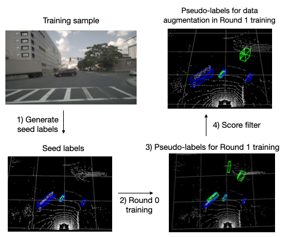

# HyperMODEST

**HyperMODEST: Self-Supervised 3D Object Detection with Confidence Score Filtering**\
Jenny Xu, Steven L. Waslander\
Submitted to the 20th Conference on Robots and Vision (CRV)

This repository is based off [MODEST](https://arxiv.org/pdf/2203.15882.pdf). 



## Overview
- [Abstract](#abstract)
- [Changelog](#changelog)
- [Model Zoo](#model-zoo)
- [Installation](#installation)
- [Getting Started](#getting-started)
- [License](#license)
- [Acknowledgement](#acknowledgement)

## Abstract
Current LiDAR-based 3D object detectors for autonomous driving are almost entirely trained on human-annotated data collected in specific geographical domains with specific sensor setups, making it difficult to adapt to a different domain. [MODEST](https://arxiv.org/pdf/2203.15882.pdf) is the first work to train 3D object detectors without any labels. Our work, HyperMODEST, proposes a universal method implemented on top of MODEST that can largely accelerate the self-training process and does not require tuning on a specific dataset. We filter intermediate pseudo-labels used for data augmentation with low confidence scores. On the nuScenes dataset, we observe a significant improvement of 1.6\% in AP_BEV in 0-80m range at IoU=0.25 and an improvement of 1.7\% in AP_BEV in 0-80m range at IoU=0.5 while only using one-fifth of the training time in the original approach by [MODEST](https://arxiv.org/pdf/2203.15882.pdf). On the Lyft dataset, we also observe an improvement over the baseline during the first round of iterative self-training. We explore the trade-off between high precision and high recall in the early stage of the self-training process by comparing our proposed method with two other score filtering methods: confidence score filtering for pseudo-labels with and without static label retention.

## Changelog
[2023-03-12] `HyperMODEST` v0.1.0 is released. 

## Model Zoo 

### nuScenes experiments
| Model | ST rounds | Checkpoint  | Config file |
| ----- | :----:  | :----: | :----: |
| PointRCNN | 1 | [link](https://drive.google.com/file/d/1C-qTkmoHjUC8EgaWfqbgIZ9TlgzHoOsu/view?usp=share_link) | [cfg](downstream/OpenPCDet/tools/cfgs/nuscenes_boston_models/pointrcnn_dynamic_obj.yaml) |
| PointRCNN | 2 | [link](https://drive.google.com/file/d/1_f_pATVTlYscuRTAC5BzTWKV-cnY5Pd9/view?usp=share_link) | [cfg](downstream/OpenPCDet/tools/cfgs/nuscenes_boston_models/pointrcnn_dynamic_obj.yaml) |
| PointRCNN | 3 | [link](https://drive.google.com/file/d/1hL4vIEdvN1cqKeJWfsGpouyURHwMn-Yb/view?usp=share_link) | [cfg](downstream/OpenPCDet/tools/cfgs/nuscenes_boston_models/pointrcnn_dynamic_obj.yaml) |
| PointRCNN | 4 | [link](https://drive.google.com/file/d/1Cwspy_8kb8pgBgkMy70WoweudDTAAk18/view?usp=share_link) | [cfg](downstream/OpenPCDet/tools/cfgs/nuscenes_boston_models/pointrcnn_dynamic_obj.yaml) |


### Lyft experiments
| Model | ST rounds | Checkpoint  | Config file |
| ----- | :----:  | :----: | :----: |
| PointRCNN | 1 | [link](https://drive.google.com/file/d/1VtHSx_8h7O6JRfBiMmBKjGlEnDxEi2BC/view?usp=share_link) | [cfg](downstream/OpenPCDet/tools/cfgs/lyft_models/pointrcnn_dynamic_obj.yaml) |


## Installation
```bash
conda create --name modest python=3.8
conda activate modest
conda install pytorch=1.9.0 torchvision torchaudio cudatoolkit=11.1 -c pytorch -c nvidia
pip install opencv-python matplotlib wandb scipy tqdm easydict scikit-learn pyquaternion pillow==8.3.2
# for managing experiments
pip install hydra-core --upgrade
pip install hydra_colorlog --upgrade
pip install rich

cd generate_cluster_mask/utils/iou3d_nms
python setup.py install
```
for OpenPCDet, follow [`downstream/OpenPCDet/docs/INSTALL.md`](downstream/OpenPCDet/docs/INSTALL.md) to install.

## Getting Started

### Data Pre-processing
Please refer to [`data_preprocessing/lyft/LYFT_PREPROCESSING.md`](data_preprocessing/lyft/LYFT_PREPROCESSING.md) and
[`data_preprocessing/nuscenes/NUSCENES_PREPROCESSING.md`](data_preprocessing/nuscenes/NUSCENES_PREPROCESSING.md).

### Training
#### 1. Generate Seed Labels
Lyft data
```bash
cd generate_cluster_mask
# generate pp score
python pre_compute_pp_score.py data_root=$(pwd)/../downstream/OpenPCDet/data/lyft/training
# generate seed labels
python generate_mask.py data_root=$(pwd)/../downstream/OpenPCDet/data/lyft/training
python generate_label_files.py data_root=$(pwd)/../downstream/OpenPCDet/data/lyft/training
```
nuScenes data
```bash
cd generate_cluster_mask
# generate pp score
python pre_compute_pp_score.py data_paths=nusc.yaml data_root=NUSCENES_KITTI_FORMAT_20HZ/training \
  nusc=True
# generate seed labels
python generate_mask.py data_paths=nusc.yaml data_root=$(pwd)/../downstream/OpenPCDet/data/nuscenes_boston/training plane_estimate.max_hs=-1.3
python generate_label_files.py data_paths=nusc.yaml data_root=$(pwd)/../downstream/OpenPCDet/data/nuscenes_boston/training image_shape="[900, 1600]"
```

#### 2. Run 0-th Round Training with seed labels
Lyft (default PRCNN model)
```
# set the flag "score_filter" to False on line 597 in 
# downstream/OpenPCDet/pcdet/datasets/kitti/kitti_dataset.py.
bash scripts/seed_training_lyft.sh
```
nuScenes (default PRCNN model)
```
# set the flag "score_filter" to False on line 597 in 
# downstream/OpenPCDet/pcdet/datasets/kitti/kitti_dataset.py.
bash scripts/seed_training_nuscenes.sh
```

#### 3. Self-training (HyperMODEST: Filter-Data-Augmentation)
Lyft (default PRCNN model)
```bash
bash scripts/self_training_lyft.sh -C "det_filtering.pp_score_threshold=0.7 det_filtering.pp_score_percentile=20 data_paths.bbox_info_save_dst=null calib_path=$(pwd)/downstream/OpenPCDet/data/lyft/training/calib ptc_path=$(pwd)/downstream/OpenPCDet/data/lyft/training/velodyne"

# Use scripts/self_training_lyft_filter_pseudo_labels.sh for score filtering on pseudo-labels, referred to as Algorithm 1 "Filter-Pseudo-Labels" in the paper. 
# Use scripts/self_training_lyft_filter_and_keep_static.sh for score fitering on pseudo-labels with static labels retention, referred to as Algorithm 2 "Filter-And-Keep-Static" in the paper. 

```
nuScenes (default PRCNN model)
```bash
bash scripts/self_training_nusc.sh -C "data_paths=nusc.yaml det_filtering.pp_score_threshold=0.7 det_filtering.pp_score_percentile=20 data_paths.bbox_info_save_dst=null calib_path=$(pwd)/downstream/OpenPCDet/data/nuscenes_boston/training/calib ptc_path=$(pwd)/downstream/OpenPCDet/data/nuscenes_boston/training/velodyne image_shape=[900,1600]"

# Use scripts/self_training_nusc_filter_pseudo_labels.sh for score filtering on pseudo-labels, referred to as Algorithm 1 "Filter-Pseudo-Labels" in the paper. 
# Use scripts/self_training_nusc_filter_and_keep_static.sh for score fitering on pseudo-labels with static labels retention, referred to as Algorithm 2 "Filter-And-Keep-Static" in the paper. 
```

### Evaluation
```bash
cd downstream/OpenPCDet/tools
bash scripts/dist_test.sh 2 --cfg_file <cfg> --ckpt <ckpt_path>
```

## License
`HyperMODEST` is released under the [MIT license](LICENSE).
We use [OpenPCDet](https://github.com/open-mmlab/OpenPCDet) in this project and it is under the Apache-2.0 License.

This repository is based off [MODEST](https://github.com/YurongYou/MODEST) and it is under the MIT license.
We list our changes [here](CHANGES.md).

## Acknowledgement
This work is based off [MODEST](https://github.com/YurongYou/MODEST) and uses [OpenPCDet](https://github.com/open-mmlab/OpenPCDet). We would like to thank the authors for open-sourcing the codebase. 

